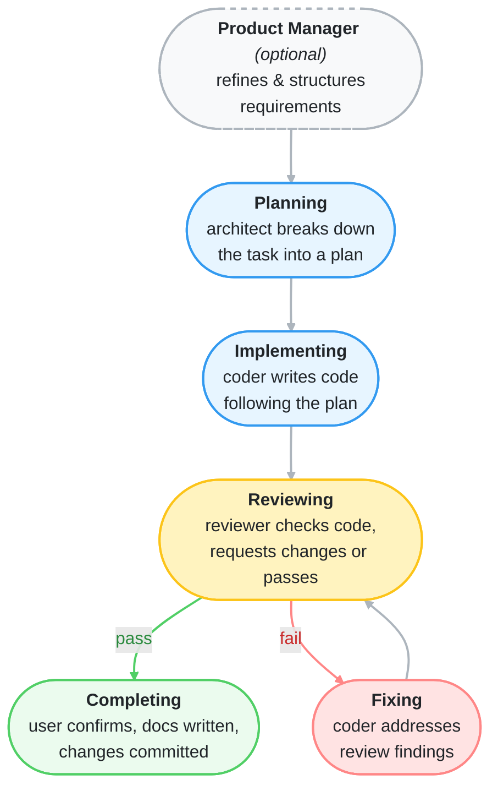

# AgentMux

**Multi-agent software development pipelines using the AI CLI tools you already have.**

AgentMux orchestrates a structured workflow across multiple AI agents — architect, coder, reviewer, and more — by driving existing CLI tools like `claude`, `codex`, `gemini`, and `opencode` through tmux. No new API keys. No per-token billing. Just your existing subscriptions, composed into a team.

---


---

## How it works

The pipeline is static and deterministic. AgentMux defines the workflow; the agents execute it.



At each phase, the orchestrator selects the right agent role, renders the appropriate prompt, and injects it into the agent's tmux pane. Agents write their outputs to shared files. The orchestrator watches for those files and advances the state machine accordingly.

Agents never talk to each other — the orchestrator mediates everything through the filesystem.

## Key design choices

**CLI tools as agents, not API calls.** AgentMux talks to `claude`, `codex`, `gemini`, and `opencode` by simulating keystrokes in tmux panes. This means you reuse your existing subscriptions and authenticated sessions — no separate API credentials required.

**Mix and match providers per role.** Each role (architect, coder, reviewer, etc.) can use a different provider and capability tier, configured in a single JSON file. Run your architect on Claude Opus and your coder on Codex. Switch providers without touching the pipeline code.

**The pipeline is the product.** Workflow logic lives in the orchestrator, not the agents. Agents receive focused, role-specific prompts and produce structured file outputs. This separation makes it easy to swap agents, tune prompts, or extend phases.

## Quickstart

```bash
pip install -r requirements.txt

# Run a feature from description to reviewed, committed code
python3 pipeline.py "Add rate limiting to the API"

# Optional: start with a product management phase
python3 pipeline.py "Add rate limiting to the API" --product-manager

# Resume an interrupted run
python3 pipeline.py --resume
```

AgentMux creates a tmux session you can attach to at any time. A narrow control pane on the left shows pipeline status, active agents, and generated documents. Agent panes on the right show each tool running live.

## Configuration

Edit `pipeline_config.json` to assign providers and tiers to each role:

```json
{
  "provider": "claude",
  "architect": { "tier": "max" },
  "coder":     { "provider": "codex", "tier": "standard" },
  "reviewer":  { "tier": "standard" },
  "docs":      { "tier": "low" }
}
```

Tiers (`max`, `standard`, `low`) map to concrete models per provider:

| Tier     | claude  | codex            | gemini              |
|----------|---------|------------------|---------------------|
| max      | opus    | gpt-5.4          | gemini-2.5-pro      |
| standard | sonnet  | gpt-5.3-codex    | gemini-2.5-flash    |
| low      | haiku   | gpt-5.1-mini     | gemini-2.5-flash-lite |

## Supported providers

- `claude` — Claude Code CLI
- `codex` — OpenAI Codex CLI
- `gemini` — Google Gemini CLI
- `opencode` — OpenCode CLI

## Agent roles

| Role | When active |
|------|-------------|
| `product-manager` | Optional first phase — refines requirements |
| `architect` | Planning and replanning |
| `coder` | Implementation and fixes |
| `reviewer` | Code review and user confirmation gate |
| `code-researcher` | On-demand codebase analysis |
| `web-researcher` | On-demand internet search |

## Requirements

- Python 3.10+
- tmux
- One or more supported AI CLI tools installed and authenticated

## Documentation

- [`docs/configuration.md`](docs/configuration.md) — Provider and tier configuration
- [`docs/file-protocol.md`](docs/file-protocol.md) — Shared file protocol between agents and orchestrator
- [`docs/tmux-layout.md`](docs/tmux-layout.md) — Session layout and pane lifecycle
- [`docs/research-dispatch.md`](docs/research-dispatch.md) — Code and web researcher dispatch
- [`docs/completing-phase.md`](docs/completing-phase.md) — Approval flow and commit selection
- [`docs/session-resumption.md`](docs/session-resumption.md) — Resuming interrupted pipelines
